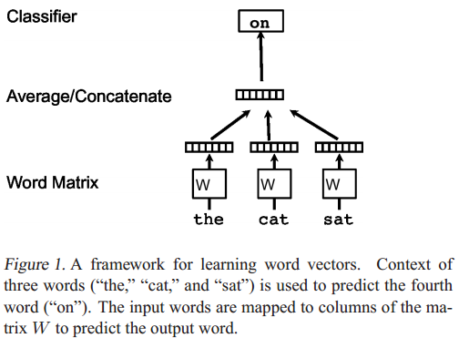
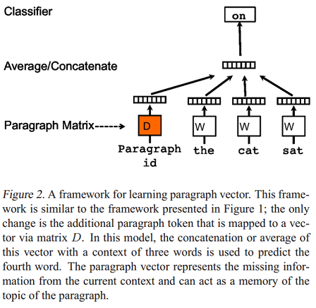
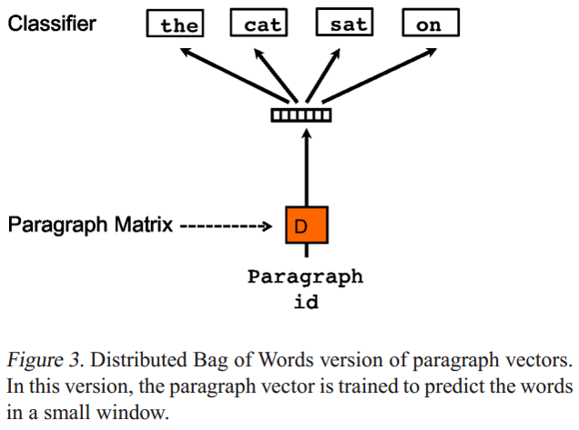

# 论文笔记：Distributed Representations of Sentences and Documents

## Introduction

### Question 

- **机器学习算法要求文本输入被表示为固定长度的向量**

### Solution

- **The bag-of-words or bag-of-n-grams**
  - 优点： 简单，有效，并且可以得到不错的精确度
  - 缺点：
    - 失去了词序信息
    - 忽略了词的语义信息
    - 往往有**数据稀疏**(data sparsity)和**高维**(high dimensionality)的问题，导致模型泛化能力较低
- **Using the word vectors**
  - 使用文档（document）中所有词向量的加权平均作为文档表示
    - 缺点：失去了词序信息
  - 根据句子的句法树，使用矩阵-向量操作(matrix-vector operations)，将词向量按一定顺序拼接在一起 [(Socher et al., 2011b) ](https://nlp.stanford.edu/pubs/SocherLinNgManning_ICML2011.pdf)
    - 缺点：由于依赖句法树，仅仅适用于句子
  - ***Paragraph Vector*** (本篇论文内容)

## Algorithms

### Learning Vector Representation of Words

论文首先回顾了如何学习词的表示。如下图：

- **The  objective**: 最大化平均对数概率，即给定上下文，预测最可能的目标词

   $$\frac{1}{T} \sum\limits_{t=k}^{T-k} \log{p(w_t|w_{t-k}, \dots, w_{t+k})}$$

- **The prediction task**: 一个多类别分类器，如softmax:

  $$p(w_t|w_{t-k}, \dots , w_{t+k}) = \frac{e^{y_{w_t}}}{\sum_i{e^{y_i}}}$$ 

  - $y$的计算公式如下：$$y=b+Uh(w_{t-k}, \dots, w_{t+k}; W)$$ , 其中, $U$, $b$ 是softmax的参数。$h$ 是一个输入多个词向量，输出一个向量的函数，通常设置为向量均值函数或向量连接函数。多个词向量通过对词向量矩阵$W$ 进行Lookup获得。
  - 由于词表可能很大，softmax计算代价很大，因此可以采取一些加速trick，如Hierarchical softmax
    - 基于binary Huffman tree, 词频大的词用短的编码

### Paragraph Vector: A distributed memory model(PV-DM) 

**Paragraph Vector: A distributed memory model(PV-DM)** 是论文提出的第一个学习段落向量的模型，如下图：

- 模型的具体步骤如下：
  - 每个段落都映射到一个唯一的向量，由矩阵$D$中的一列表示，每个词也被映射到一个唯一的向量，表示为$W$ ;
  - 对**当前段落向量**和**当前上下文**所有词向量一起进行取平均值或连接操作，生成的向量用于输入到softmax层，以预测上下文中的下一个词: $$y=b+Uh(w_{t-k}, \dots, w_{t+k}; W; D)$$ 
- 这个段落向量可以被认为是另一个词。可以将它理解为一种记忆单元，记住**当前上下文所缺失的内容**或段落的**主题** ；
- 矩阵$D$ 和$W$ 的区别:
  - 通过当前段落的index，对$D$ 进行Lookup得到的段落向量，对于当前段落的所有上下文是共享的，但是其他段落的上下文并不会影响它的值，也就是说它**不会跨段落(not across paragraphs)** ；
  - 当时词向量矩阵$W$对于所有段落、所有上下文都是共享的。

### Paragraph Vector without word ordering: Distributed bag of words (PV-DBOW)

**Paragraph Vector without word ordering: Distributed bag of words (PV-DBOW)** 是论文提出的第二个学习段落向量的模型，如下图：

- PV-DBOW模型的输入忽略了的上下文单词，但是关注模型从输出的段落中预测从段落中随机抽取的单词；
- PV-DBOW模型和训练词向量的**Skip-gram模型**非常相似。

## Experiments

论文设置了三个实验，分别是**句子级别的情感分析**(Sentiment Analysis)、**篇章级的情感分析** 以及**信息检索** ，验证了**paragraph vector** 的有效性。

### Sentiment Analysis with the Stanford Sentiment Treebank Dataset

- **Dataset**
  - There are239,232 labeled phrases in the dataset. ([http](http://nlp.stanford.edu/sentiment/)[://nlp.Stanford.edu/sentiment](http://nlp.stanford.edu/sentiment/)[/](http://nlp.stanford.edu/sentiment/))（句子级别的情感分析）
- **Tasks and Baselines** 
  - a 5-way fine-grained classification task where the labels are {Very Negative, Negative,Neutral, Positive, Very Positive}
  - a 2-way coarse-grained classification task where the labels are{Negative, Positive}.
- **Experimental protocols**
  - Each subphrase is treated as an independent sentence 
  - Classifier: logistic regression 
  - Window size is 8
  - Classifier input: a concatenation of two vectors (800 dim), one from PV-DBOW(400dim) and one from PV-DM(400dim)
    - In PV-DM, 400 dimensions for both words and paragraphs, concatenate the paragraph vectors and 7 word vectors to predict the 8-th word.Special characters such as ,.!? are treated as a normal word. If the paragraph has less than 9 words, we pre-pad with a special NULL word symbol.
- Results 
  - Bag-of words or bag-of-n-grams models (NB, SVM, BiNB) perform poorly.  
  - More advanced methods (such as Recursive-NN)perform much better.
  - The method in this paper performs better than all these baselines.

###  Beyond One Sentence: Sentiment Analysis with IMDB dataset

- **Dataset** ([http](http://ai.stanford.edu/amaas/data/sentiment/index.html)[://](http://ai.stanford.edu/amaas/data/sentiment/index.html)[ai.Stanford.edu/amaas/data/sentiment/index.html](http://ai.stanford.edu/amaas/data/sentiment/index.html))
  - The100,000 movie reviews: 25,000 labeled training instances, 25,000 labeled test instances and 50,000 unlabeled training instances. (篇章级)
  - Two types of labels: Positive and Negative.
- **Experimental protocols**
  - Learn the word vectors and paragraph vectors using 75,000 training documents (25,000 labeled and 50,000 unlabeled instances) 
  - Window size is 10 words.
  - Classifier:  a neural network with one hidden layer with 50units and a logistic classifier
  - Classifier Input: the same as Sentiment Analysis with the Stanford Sentiment Treebank Dataset
- **Results**  
  - For long documents, bag-of-words models perform quite well (12.20%) and it is difficult to improve upon them using word vectors. The significant improvements:
    - Combine a Restricted Boltzmann Machines model with bag-of-words.(10.77%) 
    - NBSVM on bigram features.  (8.78%)
  - Best result:  **Paragraph Vectors**. (7.42%)

### Information Retrieval with Paragraph Vectors

- **Dataset**: a new dataset to test vector representations of paragraphs.
  - 数据集中的段落是由使用一个搜索引擎从100万个最受欢迎的查询返回的前10个结果构成；
  - 对于每个查询，创建一个段落的三元组: 三元组的前两个段落是同一个查询的结果，而第三个段落是从其他查询结果中随机抽取的段落。
- **Tasks**
  - **The Principle**: 一个更好的表示（representation）应该使得相同查询返回的段落之间的距离很近，而不同查询返回的段落之间的距离很大。
  - 记录三元组中前两个段落所产生的距离比第一段和第三段小的次数。如果一个三元组段落中无法产生理想的距离度量，该三元组就作为一个错误实例。
- **Experimental protocols**: 80% for training, 10% for validation, and 10% for testing 
- **Results**
  - TF-IDF weighting performs better than raw counts(so only report the results of methods with TF-IDF weighting. 
  - The paragraph vector method significantly outperforms bag of words and bigrams.
  - **Paragraph Vector is useful for capturing the semantics of the input text** 

## Conclusions

- **Some further observations**
  - PV-DM is consistently better than PV-DBOW. 
  - The combination of PV-DM and PV-DBOW often work consistently better (recommended).
  - Using concatenation in PV-DM is often better than sum. 
    - Perhaps,this is because the model loses the ordering information if using sum.
  - It’s better to cross validate the window size. A good guess of window size in many applications is between 5 and 12. 
  - Paragraph Vector can be expensive, but it can be done in parallel at test time.
- **Advantages of paragraph vectors**
  - They are learned from unlabeled data.
  - They inherit an important property of the word vectors: the semantics of the words. So they are useful for capturing the semantics of the input text 
  - They take into consideration the word order.
  - It is general and applicable to texts of any length: sentences, paragraphs, and documents.
  - It does not require task-specific tuning of the word weighting function nor does it rely on the parse trees. 