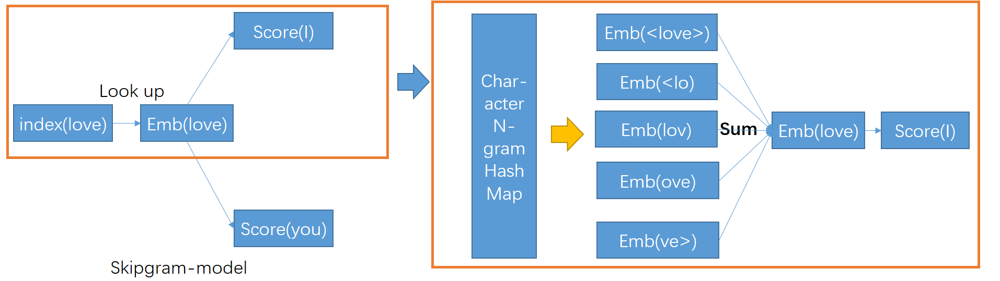

# 论文笔记：Enriching Word Vectors with Subword Information 

- 正如论文标题所言，该篇论文将词的部分构成(subword)信息融入到词向量中，以丰富词向量的内涵。

- 论文具体做法是**将每个词$w$ 作为a bag of character n-gram** 来表示：

  - 在单词的开头和结尾添加特殊的边界符号'<'和'>'，以区分前缀后缀与其他字符序列
  - 将词$w$本身也包含在它的n-gram中
  - 以词$w$ 为*where* ，$n=3$ 为例，注意$her$ 区分 $\<her\>$
    - $$\{<wh, whe, her, ere, re>,<where>\}​$$
  - 在实践中， 抽取所有的n-gram，其中$3 \leq n \leq 6$

- 然后，**用一个词的n-gram的每个向量表示的和作为该词的表示**，下图为将skip-gram模型转为本篇论文的模型示例。

  

- **模型优点**: 融入subword信息的主要优点是**允许在单词之间共享subword表示，这样就有助于更好地学习到低频词的可靠表示**。

  - 注意：和论文[Finding Function in Form: Compositional Character Models for Open Vocabulary Word Representation](https://github.com/llhthinker/NLP-Papers/blob/master/distributed%20representations/2017-11/Finding%20Function%20in%20Form%20Compositional%20Character%20Models/note.md) 中的方法相比，本篇论文并不能表示未登录词，因为在词向量的形成过程中仍需要词本身。

- [fastText](https://github.com/facebookresearch/fastText) 包含了该篇论文的具体实现。**对于一些任务而言，预训练使用fastText可能比传统的word2vec（如gensim中的实现）要好**。
