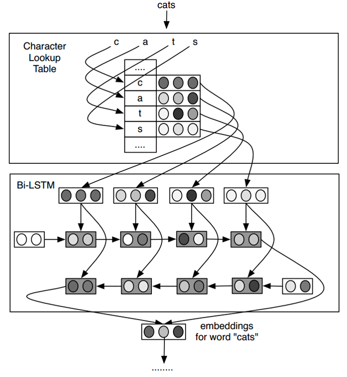

# 论文笔记：Finding Function in Form: Compositional Character Models for Open Vocabulary Word Representation 

## Problem: Independent Parameters 

- 词的lookup table不能生成未包含在词表中的词的表示。

## Solution: Compositional Models 

- 将每个词当作字符序列，使用双向LSTM来读字符序列，将它们合并成一个向量生成词的表示。
- 具体地，使用字符级别的look up表，将一个词映射为多个字符向量，将字符向量输入到正向(forward) LSTM，得到最后一个状态向量$S^f_m$ ，将字符向量输入到反向(backward) LSTM，得到最后一个状态向量$S^b_0$ , 然后通过如下公式合并两个状态向量，生成最终的词表示。

$$e_w^C=D^fS_m^f+D^bs_0^b+b_d$$

- 该模型假定每个字符可以与一个向量关联(可以表示为一个向量)，然后LSTM模型将这些向量进行编码，而这个编码同时包含特殊的词法和正规的形态学知识。

## Advantages

- 对于在语法上和语义上相似的单词，即使是单词在拼写上的距离较大，也能产生类似的表示 (e.g., October and January) ；
- 对于语素丰富的语言（morphologically rich languages），在POS标记任务上可以取得引人注目的提升；
- 虽然该模型计算代价较高，但是它可以为最频繁出现的单词存储一个对于的表示列表，而对于低频词才真正运行该模型。
- 模型相较于word2vec最大的优点就是可以根据未登录词的字符计算未登录词的表示。