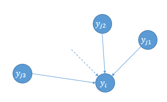

# Visualizing data using t-SNE

* 如果您在GitHub上在线浏览本页面，强烈建议使用Chrome插件「GitHub with MathJax」来渲染本页面的数学公式。

## Introduction

* Visualizes high-dimensional data by giving each data point a location in a 2 or 3-dimensional map. 
* Most of these techniques simply provide tools to **display** more than two data dimensions, and leave the **interpretation** of the data to the human observer.
* The **aim of dimensionality reduction** is to **preserve as much of the significant structure** of the high-dimensional data as possible in the low-dimensional map. 
* 传统的**线性技术**主要是想让**不相似的点**在低维表示中**分开**。
  * PCA（Principle Components Analysis，主成分分析）
  * MDS（Multiple Dimensional Scaling，多维缩放）
* 对于处于低维、非线性**流形**上的高维数据而言，更重要的是让**相似的近邻点**在低维表示中**靠近**。**非线性技术**主要保持数据的**局部结构**。
  * Sammon mapping
  * CCA（Curvilinear Components Analysis）
  * **SNE（Stochastic Neighbor Embedding，随机近邻嵌入）**，**t-SNE是基于SNE的**。
  * Isomap（Isometric Mapping，等度量映射）
  * MVU（Maximum Variance Unfolding）
  * LLE（Locally Linear Embedding，局部线性嵌入）
  * Laplacian Eigenmaps
* In particular, most of the techniques are **not capable** of retaining **both** the **local** and the **global structure** of the data in a single map. 
* In this paper, we introduce 
  * a way of converting a high-dimensional data set into a **matrix of pairwise similarities** and,
  * a new technique, called “**t-SNE**”, for visualizing the resulting similarity data. 

## SNE

* Stochastic Neighbor Embedding，随机近邻嵌入

* SNE starts by **converting** the high-dimensional **Euclidean distances** between datapoints into **conditional probabilities** that represent similarities.

  * 一种基于概率的数据降维处理方法。
  * 可以提供原始数据，也可以只提供点之间的相似度，两种输入均可。

* Given a set of **high-dimensional** data points $x_1, x_2, ..., x_n$, $p_{i|j}$ is the **conditional probability** that $x_i$ would pick $x_j$ as its neighbor if neighbors were picked in proportion to their probability density under a Gaussian **centered at $x_i$**.

  $$p_{j|i} = \frac{exp(-||x_i-x_j||^2/2\sigma_i^2)}{\sum_{k\neq i}exp(-||x_i-x_k||^2/2\sigma_i^2)}$$

  注意：1）分母即归一化。2）默认$p_{i|i}=0$。3）每不同数据点$x_i$有不同的$\sigma_i$。其计算方式下面说。

* Similarly, define $q_{i|j}$ as **conditional probability** corresponding to **low-dimensional** representations of $y_i$ and $y_j$ (corresponding to $x_i$ and $x_j$). The variance of Gaussian in this case is set to be $1/\sqrt{2}$.

  $$q_{j|i} = \frac{exp(-||y_i-y_j||^2)}{\sum_{k\neq i}exp(-||y_i-y_k||^2)}$$

  注意：若方差取其他值，对结果影响仅仅是缩放而已。

* If the map points $y_i$ and $y_j$ correctly model the similarity between the high-dimensional data points $x_i$ and $x_j$, the conditional probabilities $p_{j|i}$ and $q_{j|i}$ will be equal.

* SNE aims to find a low-dimensional data representation that **minimizes the mismatch between  $p_{j|i}$ and $q_{j|i}$**. Thus we use the **sum of Kullback-Leibler divergences over all data points** as the **cost function**:

  $$C=\sum_i KL(P_i||Q_i) = \sum_i \sum_j p_{j|i} log\frac{p_{j|i}}{q_{j|i}}$$

  in which $P_i(k=j)=p_{j|i}$ represents the conditional probability **distribution** over **all other data points** given data point $x_i$.  $Q_i(k=j)=q_{j|i}$ too.

  注意：KLD是不对称的！因为 $KLD=p log(\frac{p}{q})$，p>q时为正，p<q时为负。则如果**高维数据相邻**而**低维数据分开**（即p大q小），则**cost很大**；相反，如果**高维数据分开**而**低维数据相邻**（即p小q大），则**cost很小**。所以**SNE倾向于保留高维数据的局部结构**。

* 对$C$进行梯度下降即可以学习到合适的$y_i$。

  The gradient:

  $$\frac{\partial C}{\partial y_i} = 2 \sum_j (p_{j|i} - q_{j|i} + p_{i|j} - q_{i|j})(y_i - y_j)$$

  and the gradient update with a momentum term:（这里给出但个$y_i$点的梯度下降公式，显然需要对所有$\mathcal{Y}^{(T)}=\{y_1, y_2, ..., y_n\}$进行统一迭代。）

  $$y_i^{(t)} = y_i^{(t-1)} + \eta \frac{\partial C}{\partial y_i} + \alpha(t)( y_i^{(t-1)} - y_i^{(t-2)})$$

  t-SNE has a cost function that is not convex, i.e. with different initializations we can get different results. 很难优化，也对初值十分敏感，因此要跑多次SNE选取KLD最小/可视化最好结果。（注意这个不是为了泛化，因此选最好的结果即可。）

* 如何为每一个$x_i$选取对应的$\sigma_i$？

  * It is not likely that there is a single value of $\sigma_i$ that is optimal for all data points in the data set because the density of the data is likely to vary. **In dense regions, small $\sigma_i$, while in sparse region, large $\sigma_i$.**

  * Every $\sigma_i$ is either set by hand （不忍吐槽，原话见于(Hinton and Roweis, 2003)） or found by a simple binary search (Hinton and Roweis, 2003) or by a very robust root-finding method (Vladymyrov and Carreira-Perpinan, 2013) 

  * 使用算法来确定$\sigma_i$要求用户预设困惑度（perplexity）。然后算法找到合适的$\sigma_i$值让条件分布$P_i$的困惑度等于用户预定义的困惑度即可。

    $Perp(P_i) = 2^{H(P_i)} = 2^{-\sum_j p_{j|i} log_2 p_{j|i}}$

    注意：困惑度设的大，则显然$\sigma_i$也大。The perplexity increases **monotonically** with the variance $\sigma_i$.

  * The perplexity can be interpreted as a smooth measure of **the effective number of neighbors**. The performance of SNE is fairly robust to changes in the perplexity, and **typical values are between 5 and 50.**

## t-SNE

- **t-Distributed** Stochastic Neighbor Embedding
- SNE有两个问题：
  - Cost function 难以优化 -> 解决方案：使用Symmetric SNE。
  - Crowding Problem -> 解决方案：在低维嵌入上使用Student's t-distribution替代Guassian distribution，同时也简化了cost function。

### Symmetric SNE

- We define the **joint probabilities** $p_{ij}$ in the high-dimensional space to be the **symmetrized conditional probabilities**, that is, we set 

  $$p_{ij} = \frac{p_{j|i} + p_{i|j}}{2n}$$

- minimizing the sum of KLD between conditional probabilities -> minimizing a single KLD between joint probability distribution.

  $$C = KL(P||Q) = \sum_i \sum_j p_{ij} log \frac{p_{ij}}{q_{ij}}$$

- The main advantage of the symmetric version of SNE is the **simpler form of its gradient**, which is faster to compute. 

- $$\frac{\partial C}{\partial y_i} = 4 \sum_j (p_{ij} - q_{ij})(y_i - y_j)$$ 

  (注意：这只是Symmetric SNE的梯度公式，t-SNE的梯度公式类似，推导见后。)

### Crowding Problem

- **“crowding problem”**: the area of the two-dimensional map that is available to accommodate **moderately distant datapoints** will not be nearly large enough compared with the area available to accommodate **nearby datapoints**. 

  这句话的意思是：在二维映射空间中，能容纳**（高维空间中的）中等距离间隔点**的空间，不会比能容纳**（高维空间中的）相近点**的空间大太多。
  换言之，哪怕高维空间中离得较远的点，在低维空间中留不出这么多空间来映射。于是到最后高维空间中远的、近的点，在低维空间中统统被塞在了一起，这就叫做“**拥挤问题（Crowding Problem）**”。

- Note that **the crowding problem is not specific to SNE**, but that it also occurs in other local techniques for multidimensional scaling such as Sammon mapping.

- One way around this problem is to use **UNI-SNE** (Cook et al. 2007)

  这种方法直接给低维空间的点给予一个均匀分布（uniform dist），使得对于高维空间中距离较远的点（$p_{ij}$较小），强制保证在低维空间中$q_{ij}>p_{ij}$ （因为均匀分布的两边比高斯分布的两边高出太多了）。

- Although **UNI-SNE usually outperforms standard SNE**, the optimization of the UNI-SNE **cost function is tedious**. 

  在低维空间中使用均匀分布（UNI-SNE）替代高斯分布（SNE），但cost function优化很复杂，这也是转而使用t分布（t-SNE）取代高斯分布（SNE）的动机。

### t-SNE

* Instead of Gaussian, use a **heavy-tailed distribution (like Student-t distribution)** to convert distances into probability scores in **low dimensions**. This way **moderate** distance in high-dimensional space can be modeled by **larger** distance in low-dimensional space.

* **[Student's t-distribution](https://en.wikipedia.org/wiki/Student%27s_t-distribution) **

  * **Student's t-distribution** has the probability density function given by

    $$f(t)={\frac {\Gamma ({\frac {\nu +1}{2}})}{{\sqrt {\nu \pi }}\,\Gamma ({\frac {\nu }{2}})}}\left(1+{\frac {t^{2}}{\nu }}\right)^{\!-{\frac {\nu +1}{2}}}$$

    where $\nu$ is the number of degrees of freedom.

  * Special cases $\nu = 1$

    $$f(t) =  \frac{1}{\pi (1+t^2)}$$

    Called **Cauchy distribution**. 我们用到是这个简单形式。

  * Special cases $\nu = \infty$

    $$f(t) = \frac{1}{\sqrt{2\pi}} e^{-\frac{t^2}{2}}$$

    Called **Guassian/Normal distribution**.

  * 

* Why choose t-dist?

  - it is **closely related** to the Gaussian distribution, as the **Student t-distribution is an infinite mixture of Gaussians**. 
  - A computationally convenient property is that it is **much faster to evaluate** the density of a point under a Student t-distribution than under a Gaussian **because it does not involve an exponential**.

* Why choose t-dist with single degree of freedom?

  * Because it has particularly nice property: inverse square law. This makes the map’s representation of joint probabilities (almost) invariant to changes in the scale of the map for map points that are far apart. 意思是：这个平方反比的形式，使得当高维空间的两个点再远，他们在低维空间的联合概率几乎不变。结合上一节提到的UNI-SNE：

    > 给低维空间的点给予一个均匀分布（uniform dist），使得对于高维空间中距离较远的点（$p_{ij}$较小），强制保证在低维空间中$q_{ij}>p_{ij}$ （因为均匀分布的两边比高斯分布的两边高出太多了）。

    从上面的t分布图中可以看到，由于t分布的尾巴高于高斯分布的尾巴，使用t分布同样可以保证对于高维空间中的远距离点，使得在低维空间中$q_{ij}>p_{ij}$。

* The joint probabilities $q_{ij}$ are defined as

  $$q_{ij} = \frac{(1 + ||y_i - y_j||^2)^{-1}}{\sum_{k\neq l}(1+||y_k - y_l||^2)^{-1}}$$

  （注意：和SNE的$q_{j|i}$公式相比，分母中求和号中，之前是$k\neq i$，表示仅排除$i$自身项；现在是$k\neq l$，表示排除所有自身项 ）

* The cost function is easy to optimize.

  $$\frac{\partial C}{\partial y_i} = 4 \sum_j (p_{ij} - q_{ij})(y_i - y_j)(1+ ||y_i - y_j||^2)^{-1}$$

  （注意：是在Symmetric SNE的梯度公式后面加上了$(1+ ||y_i - y_j||^2)^{-1}$一项，推导见论文附录A。）

### Complexity

- **Space and time complexity is quadratic ($O(n^2)$)** in the number of datapoints so infeasible to apply on large datasets.
- Random walk
  - Select a random subset of points (called landmark points) to display.
  - for each landmark point, define a random walk starting at a landmark point and terminating at any other landmark point.
  - $p_{i|j}$ is defined as fraction of random walks starting at $x_i$ and finishing at $x_j$ (both these points are landmark points). This way, $p_{i|j}$ is not sensitive to "short-circuits" in the graph (due to noisy data points).
- **Barnes-Hut approximations** (Van Der Maaten, 2014)
  - allowing it to be applied on large real-world datasets. We applied it on data sets with up to 30 million examples.

## Advantages of t-SNE

- Gaussian kernel employed by t-SNE (in high-dimensional) defines a soft border between the local and global structure of the data.
- Both nearby and distant pair of datapoints get equal importance in modeling the low-dimensional coordinates.
- The local neighborhood size of each datapoint is determined on the basis of the local density of the data.
- Random walk version of t-SNE takes care of "short-circuit" problem.

## Limitations of t-SNE

- it is unclear how t-SNE performs on general dimensionality reduction tasks, 
- the relatively local nature of t-SNE makes it sensitive to the curse of the intrinsic dimensionality of the data, and 
- t-SNE is not guaranteed to converge to a global optimum of its cost function. 

## 彩蛋

* 关于SNE的梯度公式

  $$\frac{\partial C}{\partial y_i} = 2 \sum_j (p_{j|i} - q_{j|i} + p_{i|j} - q_{i|j})(y_i - y_j)$$

  作者在论文第4页用了一个弹簧的比喻来解释，如图：

  

  可以把该公式看做是所有$y_j$通过弹簧（图中箭头）对$y_i$的合力，类比胡克定律$F=k\Delta x$，这里$(y_i - y_j)$表示拉伸长度，而$(p_{j|i} - q_{j|i} + p_{i|j} - q_{i|j})$表示弹性系数。表示**高维数据点和低维映射点之间点相似度的失配程度（mismatch between the pairwise similarities of the data points and the map points）**。按这么来说，弹性系数应该写成$(\frac{p_{j|i} + p_{i|j}}{2} - \frac{q_{j|i} + q_{i|j}}{2})$的形式，有趣的是，如果写成这种形式，则SNE、Symmetric SNE、t-SNE的梯度公式形式上就统一了。

  |               |                 Gradient                 |
  | :-----------: | :--------------------------------------: |
  |      SNE      | $\frac{\partial C}{\partial y_i} = 4 \sum_j (\frac{p_{j|i} + p_{i|j}}{2} - \frac{q_{j|i} + q_{i|j}}{2})(y_i - y_j)$ |
  | Symmetric SNE | $\frac{\partial C}{\partial y_i} = 4 \sum_j (p_{ij} - q_{ij})(y_i - y_j)$ |
  |     t-SNE     | $\frac{\partial C}{\partial y_i} = 4 \sum_j (p_{ij} - q_{ij})(y_i - y_j)(1+ ||y_i - y_j||^2)^{-1}$ |

