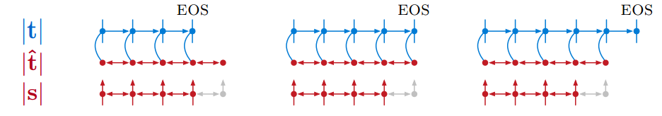

# 论文阅读：Neural machine translation in linear time

## Pre: Receptive field

*   感受野（Receptive Field）的定义：卷积神经网络的每一层输出的特征图上的像素点在**原**图像上映射的区域大小。[^ 1]

*   感受野计算公式：
    *   $n=1$时，$r_1 = k_1$
    *   $n \geq 2$时，$r_n = r_{n-1} + (k_n - 1) \cdot (\prod_{i=1}^{n-1}s)$
    *   其中r表示receptive field，k表示kernel size，s表示stride。
*   以图为例：
    *   $n=1$时，$r_1 = k_1 = 3$
    *   $n=2$时，$r_2 = r_1 + (k_2 - 1)\cdot s_1 = 3 + (2 - 1) \cdot 2 = 5$

## Pre: Dilated convolution

*   多层 CNN 的一个**不足之处在于**，**由于池化层的存在，响应张量的大小（长和宽）越来越小**，在一些任务比如用FCN做图像语义分割任务时，需要输入和输出的像素点一一对应，因此 FCN 做了上采样，将池化变小的层张量再变大。但是上采样并不能将丢失的信息全部无损地找回来。
*   对此，dilated convolution 是一种很好的**解决方案**——既然池化的下采样操作会带来信息损失，那么就把池化层去掉。但是池化层去掉随之带来的是网络各层的感受野（receptive field）变小，这样会降低整个模型的预测精度。**Dilated convolution 的主要贡献就是，如何在去掉池化下采样操作的同时，而不降低网络的感受野。**
*   
*   以上图为例，三张图分别都是经过dilated conv后的第一、二、三层，由于没有池化，他们大小不变。每一次dilated conv时，卷积核大小不变，但是输入的张量则是隔了几个像素点取的。也可以看做是卷积核大小变了，但是卷积核中只有9个点有权重系数，其余点的权重系数都为0。[^ 2]
*   **我自己猜的公式，暂时没有找到来源**：
    *   $n=1$时，$r_1 = k_1$
    *   $n \geq 2$时，$r_n = r_{n-1} + (k_n - 1)  \cdot (\prod_{i=1}^{n-1}s) \cdot d_{n}$
    *   其中r表示receptive field，k表示kernel size，s表示stride，d表示dilate（一般在做dilated conv时，$d_n$会取$2^{n-1}$以形成类似binary tree的结构，见本文后面的动图）。
*   以图为例：
    *   对应图a，$n=1$时：$r_1=k_1=3$
    *   对应图b，$n=2$时：$r_2 = r_1 + (k_ 2- 1) \cdot s_1 \cdot d_1 = 3 + (3-1)\cdot 1 \cdot 2 = 7$
    *   对应图c，$n=3$时：$r_3 = r_2 + (k_3 - 1) \cdot (s_1s_2) \cdot d_2 = 7 + (3-1)\cdot(1\cdot1)\cdot4 = 15$
*   该图的原论文给出的公式（符号改了一下使本文前后文统一）是$r_n=2^{n+1}-1$。[^ 3]
    *   显然我上面总结的公式是递推式，在该图中，$k=3$，$s=1$，$d_{n}=2^{n-1}$（一般在做dilated conv时，$d_n$会取$2^{n-1}$以形成类似binary tree的结构，见本文后面的动图）
    *   代入后可以得到：$r_n = r_{n-1} + (3 - 1) \cdot (\prod_{i=1}^{n-1}1) \cdot 2^{n-1}=r_{n-1} + 2^n$。
    *   解该递推公式得：$r_n=2^{n+1} - 1$，一致。

## Introduction

* 本篇论文的笔记也可以参考[^ 4]
* RNN has potential drawback.
  * serial structure prevents from being run in parallel.
  * Forward and backward signals need traverse the full distance to learn the dependencies between tokens.
* A number of NMT models
  * Encoder-decoder network, attentional pooling, 2-dimensional networks, etc
  * Despite the generally good performance, they:
    * have running time that is **super-linear** in the length of source/target sequences.
    * process the src seq into a const size representation, **burdening the model with a memorization step**.
* **ByteNet**
  * uses **one-dimensional CNN** of **fixed depth** for **both the encoder and the decoder**.
  * The two CNNs use **increasing factors of dilation** to
    rapidly grow the receptive fields

## Neural Translation Model

* Desiderata
  * First, the **running time** of the network should be **linear** in
    the length of the source and target strings.
  * Second, the **size of the source representation** should be **linear** in the length of the source string, i.e. it should be resolution preserving, and **not have constant size**.
  * Third, the **path traversed by forward and backward signals** in the network (between input and ouput tokens) **should be short**. 

## ByteNet

* **Encoder-Decoder Stacking**

  

  * 相比其他encode-decode网络的区别在于，不再仅仅通过一个定长的encode vector或者attention vector连接两个网络，而是将source network每一个输出都作为target vector对应位置上的输入。
  * 有点像是dilate=1,2,4,8...后又来了一次dilate=1,2,4,8,...
  * 但是输入和输出又不一样长，怎么直接Stack呢？

* **Dynamic Unfolding**

  * source length $|s|$, target length $|t|$
  * sufficiently tight upper bound $|\hat{t}|=a|s|+b$
  * 德语句子一般比英语长，设a=1.2，b=0 （这些都不重要。。）
  * 
  * 令encoder和decoder这两个一维卷积长度都为$|\hat{t}|​$（随着不同source句子长度变化，不固定），source端不足的就补，而target端最终预测的长度不固定，以遇到EOS为准。
    * 如果遇到EOS时的长度<$|\hat{t}|$， 则同时使用encoder的representations和decoder前面时刻的输出。
    * 如果直到超出$|\hat{t}|$都没预测完，那就只使用decoder前面时刻的输出。

* **Masked One-dimensional Convolutions**

  * 就是保证decoder只和历史相关，不和未来相关。所以decoder在每一个输出时刻只有左边一半。
  * dynamic unfolding是从左往右展开的，右边的不知道，显然没法用。

* **Dilation**

  

  ​

* **Residual Blocks 残差网络**

  * Each layer is wrapped in a residual block that contains additional convolutional layers with filters of size 1 × 1

## Model Comparison

* Time代表时间复杂度，RP代表resolution preserving，Paths代表source网络从输入到输出的路径长度，Patht代表target网络从输入到输出的路径长度。Path越短代表反向传播的层数越少，网络越容易收敛，因为网络越浅越不容易出现梯度扩散。
* ByteNet可以用RNN，也可以用CNN来实现。本文是用CNN实现的，但是也分析了一下RNN的复杂度。
* 其实之前Seq2seq的模型也是线性复杂度的，ByteNet比它好在：
  * Resolution preserving。不再是把encoder representations塞到一个固定长的向量中。
  * Path变短，为常数$c=log d$，d是在翻译中需要走过的依赖长度。
* ByteNet比attention模型好在：
  * 时间复杂度从平方复杂度变成了线性复杂度。
  * Path变短为常数。

## Experiment

* 语言模型任务（字符级）
  * 
  * 达到了SOTA
* 机器翻译任务（字符级）
  * 

## 相关阅读

[^ 1]: [深度神经网络中的感受野(Receptive Field)](https://zhuanlan.zhihu.com/p/28492837)

[^ 2]: [如何理解空洞卷积（dilated convolution）？ - 知乎](https://www.zhihu.com/question/54149221/answer/192025860)

[^ 3]: Yu, F., & Koltun, V. (2015). Multi-scale context aggregation by dilated convolutions. arXiv preprint arXiv:1511.07122.

[^ 4]: [《Neural Machine Translation in Linear Time》阅读笔记](https://zhuanlan.zhihu.com/p/23795111)