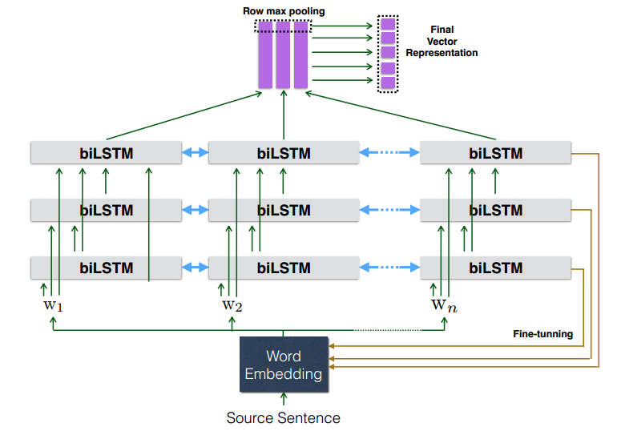
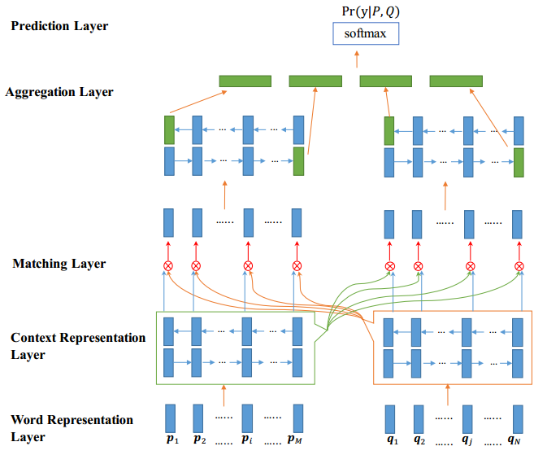
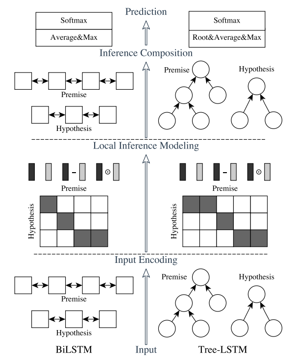

# Shortcut-Stacked Sentence Encoders for Multi-Domain Inference

论文的基本思想是：首先通过句子编码器，将两个句子分别表示成向量$v_1$和$v_2$，然后根据concatenation , element-wise distance , element-wise product 这三种匹配方式构建分类器的输入向量$v=[v_1,v_2,|v_1-v_2|,v_1\otimes v_2]$,最后将$v$通过MLP分类器进行分类。这三种匹配方式是文本匹配中常用的方式。

论文介绍了两种句子编码器。第一种编码器是在使用多层biLSTM的基础上，借鉴了残差网络的思想，采用了一种Shortcut连接方式：第$i$层的biLSTM的输入是之前所有层输出的连结(concatenation)。如下图所示，第一层biLSTM的输入是词向量，第二层biLSTM的输入是词向量与第一层biLSTM输出的连结，第三层biLSTM的输入是词向量与第一、二层biLSTM输出的连结。最后一层biLSTM的输出通过行方向的max pooling得到最终的句子向量表示。

第二种编码器为多层残差biLSTM，即第$i$层的biLSTM的输入是之前所有biLSTM层输出的和与词向量的连结。

shortcut形式的编码器相较于残差编码器，参数更多，并且随着biLSTM层数的增加而愈发明显。

# Bilateral Multi-Perspective Matching for Natural Language Sentences

该论文提出一种双边多视角匹配（Bilateral Multi-Perspective Matching, BiMPM）模型用于句子匹配。论文通过大量实验表明BiMPM模型在不同类型的句子匹配数据集上都达到了比较好的效果，包括在Quora数据集上的释义识别（paraphrase identification）任务， 在SNLI 数据集上的自然语言推理（natural language inference）任务，以及在TREC-QA和 WikiQA数据集上的答案句子选择（answer sentence selection）任务，从而说明BiMPM模型的实用性。

BiMPM模型主要分为5个部分：词表示层、上下文表示层、匹配层、聚合层以及预测层，如下图所示。下面将分别介绍这5个部分。

- 词表示层：即通过词嵌入，将每个词表示成一个向量，则一个句子表示成多个向量组成的序列。

- 上下文表示层：在词表示层的基础上，通过一个BiLSTM对句子进行上下文建模。

- 匹配层：该层是BiMPM模型的核心部分。首先，定义多视角函数$$m = f_m(v_1, v_2; W)$$
  其中$f_m$的输入是两个维度为$d$的向量$v1, v2$，输出是一个$l$维的向量$m$,  $l$为视角维度，$W$是大小为$l\times d$可训练的参数。具体地，向量$m$的第k个维度$$m_k=cosine(W_k \circ v_1, W_k \circ v_2)$$
  其中$\circ$是element-wise乘法（对位相乘）， $k \in [1,l]$。然后，基于$f_m$，采取如下四种匹配策略得到4个匹配向量$m$：

  - 全匹配(Full-Matching): 句子$P$的当前时刻的上下文表示层前向隐藏层向量（后向隐藏层向量）与另一个句子Q的上下文表示层的最后一个向量（第一个向量）作为$f_m$输入（因为上下文表示层是双向LSTM）。
  - 最大池化匹配(Maxpooling-Matching)：句子$P$的当前时刻的上下文表示层向量与另一个句子Q的上下文表示层的所有向量分别作为$f_m$输入，然后对所有输出进行maxpooling。
  - 注意力匹配(Attentive-Matching)：首先根据句子$P$当前时刻的上下文表示向量对句子$Q$进行注意力权重计算，然后对$Q$的所有向量进行加权平均得到一个向量表示，再将句子$P$当前时刻的上下文表示向量与$Q$的注意力向量作为$f_m$的输入。其中论文采取$cosine$作为注意力权重计算的函数。
  - 最大注意力匹配(Max-Attentive-Matching)：和注意力匹配策略基本类似，区别是加权平均变成了取最大。

  最终，$P$对$Q$进行匹配可以得到一组向量，向量个数等于$P$的长度， 向量维度是$l\times 8$（4种匹配策略，双向LSTM），同理，$Q$对$P$进行匹配也可以得到一组向量。

- 聚集层：使用另一个BiLSTM，对匹配层得到的两组向量序列分别进行建模，并且都取最后时刻的向量。因此最终得到4个向量（两组*双向），将这4个向量连结作为输出。

- 预测层：通过两层全连接+softmax作为分类器。

# Enhanced LSTM for Natural Language Inference

该论文提出了一种简单高效的模型用于自然语言推理任务。模型主要基于biLSTM，主要分为输入编码层（input encoding），局部推理建模层（local inference modeling）以及推理组合层（inference composition）三个组成部分。此外，论文在句法分析的基础上，使用TreeLSTM进行建模，从而充分利用句法信息，提高了模型效果。TreeLSTM建模主要过程和biLSTM基本一致，因此下面仅以biLSTM作为示例介绍。

- 输入编码层：使用biLSTM，对词向量进行编码，得到两组向量$P$ 和 $H$，$P$和$H$的向量个数与对应的句子序列长度相等。

- 局部推理建模层：对$P$ 和 $H$，进行句子间（inter-sentence）的Attention（soft-alignment），得到$H$对于$P$上的软对齐信息$\hat{P}$和$P$对于$H$上的软对齐信息$\hat{H}$ ，其中$P$和$\hat{P}$维度相同，$H$和$\hat{H}$维度相同。然后，对$P$和$\hat{P}$、$H$和$\hat{H}$对应向量的对应维度进行元素级别（element-wise）的操作，包括连结、相减、相乘。
  $$
  M_p = [P;\hat{P};P-\hat{P},P \odot\hat{P}] \\
  M_h = [H;\hat{H};H-\hat{H},H \odot\hat{H}]
  $$

- 推理组合层：使用biLSTM，对$M_p$和$M_h$进行编码，然后对所有时刻的隐状态向量进行max-pooling和avg-pooling，然后将pooling后的向量进行连结，输入到MLP中进行分类。

