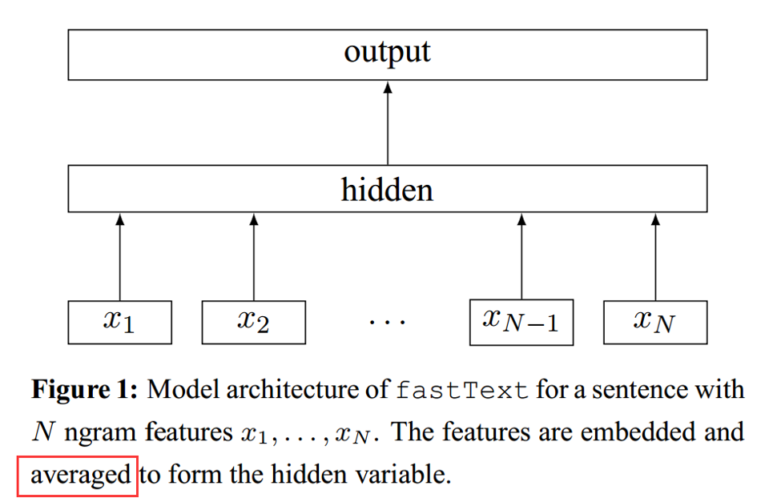

# 论文笔记：Bag of Tricks for Efficient Text Classification
## 模型架构

## 特点
- 当类别数量较大时，使用Hierachical Softmax
- 将N-gram融入特征中，并且使用Hashing trick[Weinberger et al.2009]提高效率
## Refs:
[Weinberger et al.2009] Kilian Weinberger, Anirban Dasgupta, John Langford, Alex Smola, and Josh Attenberg. 2009. Feature hashing for large scale multitasklearning. In ICML.
