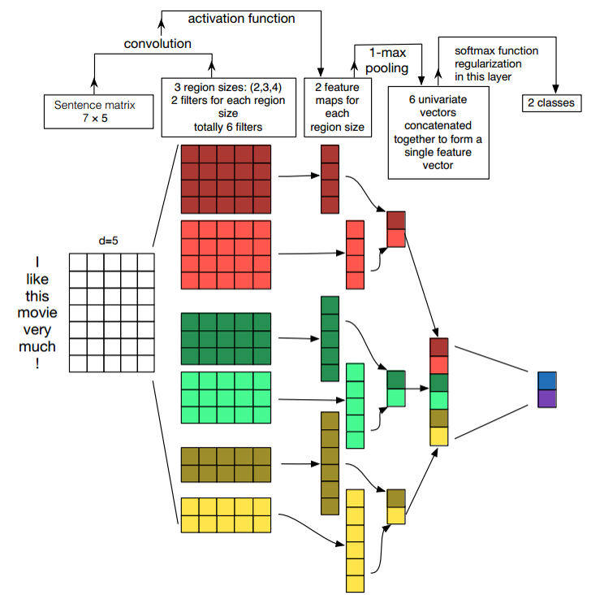
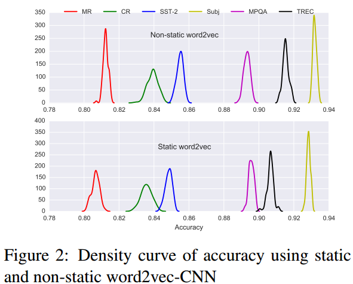
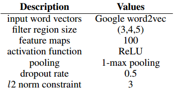
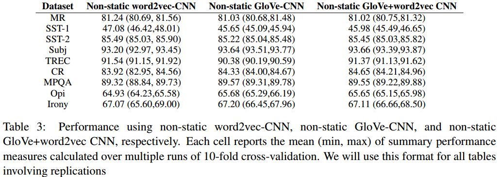
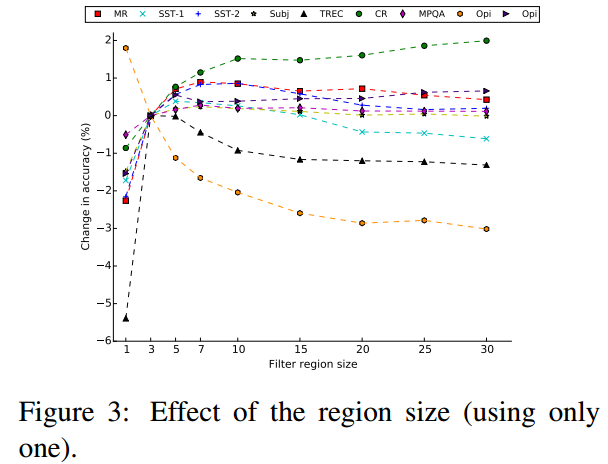
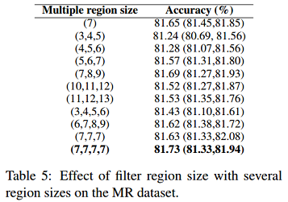
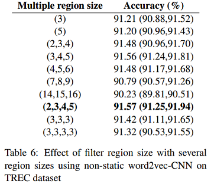
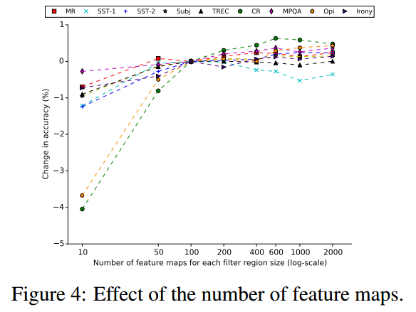
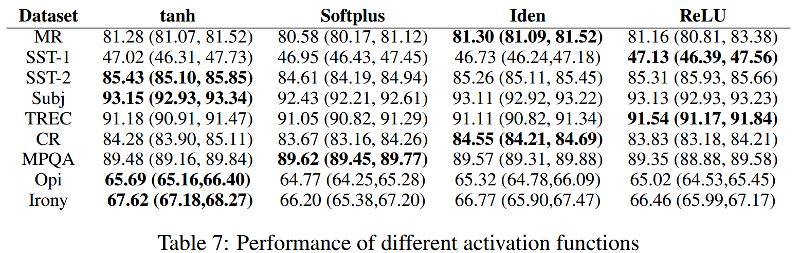

# 论文笔记：A Sensitivity Analysis of (and Practitioners' Guide to) Convolutional Neural Networks for Sentence Classification

## CNN Architecture for Sentence Classification
论文Convolutional neural networks for sentence classification[[论文笔记]](https://github.com/llhthinker/NLP-Papers/blob/master/text%20classification/2017-10/Convolutional%20Neural%20Networks%20for%20Sentence%20Classification/note.md)介绍了如何使用CNN做句子分类（文本分类），下图为一个实例图解。

## Practitioners' Guide
用于句子分类的CNN有许多超参数，这篇论文专注于对单层CNN分类效果进行分析，得出了一些具有指导意义的结论。

### Static or Non-static
通常来说，使用预训练词向量比随机初始化的效果要好。然而，使用预训练词向量初始化后，是否应该进行微调？这篇论文在多个数据集做了如下图所示的对照实验。

从实验结果可以看出，在上述所有数据集中，采取微调策略（non-static）的效果比固定词向量（static）的效果要好。因此，论文之后的实验都只报告non-static策略的对照结果。

### Baseline Configuration
参照论文Convolutional neural networks for sentence classification的设置，这篇论文的baseline参数设置如下图：

之后的对照实验都是在baseline设置上进行对比分析。在分析某个超参数时，只对该参数进行改变，其余进行保持不变（控制变量）。论文在预训练词向量、filter窗口、filter个数、激活函数、池化策略、以及正则化策略方面做对照试验，并给出了相关建议。

### Effect of input word vectors

- Word2vec-CNN: Google word2vec (300维词向量)
- GloVe-CNN: GloVe representations (300维词向量)
- GloVe+word2vec CNN: Google word2vec + GloVe representations (600维词向量)
- 建议：
    - 无法确定用那种预训练词向量更好，不同的任务结果不同，应该对于你当前的任务进行实验；
    - 论文还使用one-hot编码（特点：高维、稀疏）作为句子表示，但是实验结果不理想，这应该是因为句子的长度较短，无法在高维空间提供足够的信息。当然，如果训练语料非常充分，从头开始学习embedding可能确实更好(learning embeddings from scratch may indeed be best)。[Semi-supervised convolutional neural networks for text categorization via region embedding](http://papers.nips.cc/paper/5849-semi-supervised-convolutional-neural-networks-for-text-categorization-via-region-embedding)论文提供了一种半监督方法。

### Effect of filter region size

- 每次使用**一种类型**的filter进行实验，得到上图结果，表明filter的窗口大小设置在**1到10**之间是一个比较合理的选择。

 

- 之后论文对多种类型的filter同时使用进行了对比实验，Table 5表明在MR数据上，(7,7,7,7)的设置结果最好，而Table 6表明在TREC数据集上，(2,3,4,5)设置最好。MR数据集的最好的多类型窗口大小(7,7,7,7)的均值为7，而TREC数据集的最好的多类型窗口大小(2,3,4,5)的均值为3.5，这与**单类型**的对比实验结果保持一致。因此有如下建议：
    - First perform a coarse line-search over a single filter region size to find the ‘best’ size for the dataset under consideration
    - and then explore the combination of several region sizes nearby this single best size, including combining both different region sizes and copies of the optimal sizes. 

### Effect of number of feature maps for each filter region size

- 确定了filter窗口大小，还需求确定对每种类型的filter的个数，实验结果如上图。总结如下经验：
    - 每种窗口类型的filter对应的“最好”的filter个数(feature map数量)取决于具体数据集；
    - 但是，可以看出，当feature map数量超过600时，performance提高有限，甚至会损害performance，这可能是过多的feature map数量导致过拟合了；
    - 在实践中，**100到600**是一个比较合理的搜索空间。

### Effect of activation function

- Sigmoid, Cube, and tanh cube相较于上表中的激活函数，表现很糟糕，因此没有显示在表中；
- tanh比sigmoid好，这可能是由于tanh具有**zero centering property**(过原点)

- 与Sigmoid相比，ReLU具有**非饱和形式（a non-saturating form）**的优点，并能够加速SGD的收敛。
- 对于某些数据集，线性变换(Iden，即不使用非线性激活函数)足够捕获词嵌入与输出标签之间的相关性。（但是如果有多个隐藏层，相较于非线性激活函数，Iden就不太适合了，因为完全用线性激活函数，即使有多个隐藏层，组合后整个模型还是线性的，表达能力可能不足，无法捕获足够信息）；
- 因此，建议首先考虑ReLU和tanh，也可以尝试Iden。

### Effect of pooling strategy
- 对于句子分类任务，**1-max pooling**往往比其他池化策略要好；
- 这可能是因为上下文的具体位置对于预测Label可能并不是很重要，而句子某个具体的n-gram(1-max pooling后filter提取出来的的特征)可能更可以刻画整个句子的某些含义，对于预测label更有意义；

### Effect of regularization
- **0.1到0.5**之间的非零dropout rates能够提高一些performance（尽管提升幅度很小），具体的最佳设置取决于具体数据集；
- 对l2 norm加上一个约束往往不会提高performance（除了Opi数据集）；
- 当feature map的数量大于100时，可能导致过拟合，影响performance，而dropout将减轻这种影响；
- 在卷积层上进行dropout帮助很小，而且较大的dropout rate对performance有坏的影响。
