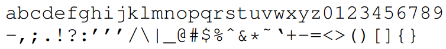
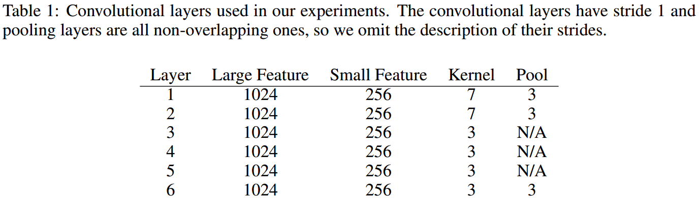
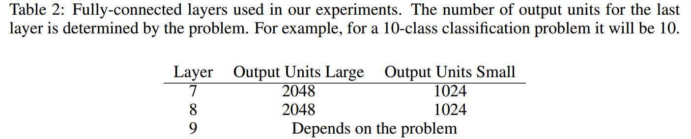
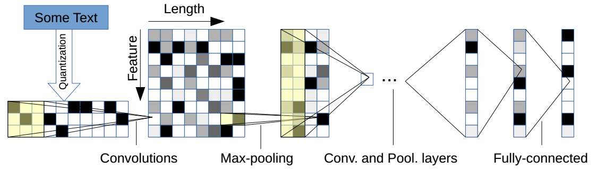
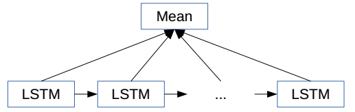
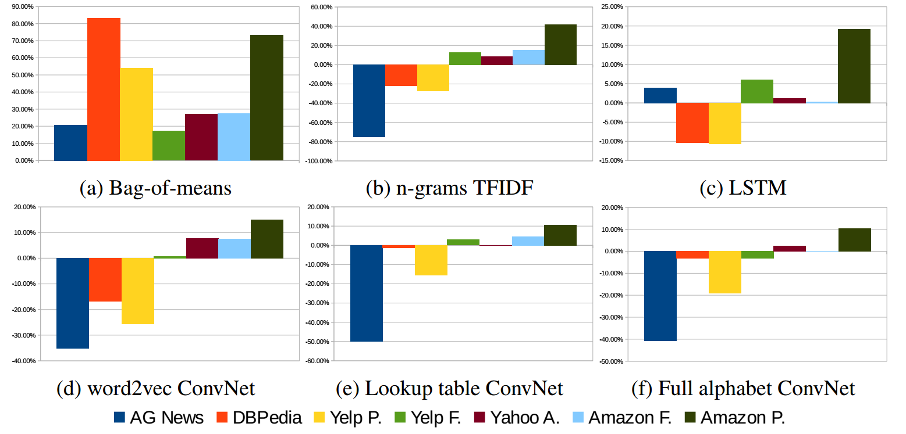

# 论文笔记：Character-level convolutional networks for text classification

## Character quantization
本篇论文使用字符级别（Character-level）的CNN进行文本分类，因此首先需要对字符进行数字化（quantization）。具体如下：

- 定义字母表(Alphabet)：大小为$m$ (对于英文$m=70$，如下图，之后会考虑将大小写字母都包含在内作为对比)

- 字符数字化（编码）： "one-hot"编码
- 序列（文本）长度：$l_0$ (定值)

## Model Design
设计两种类型的卷积网络：Large和Small（作为对照实验）：

- 它们都有9层，其中6层为卷积层(convolutional layer)，设置如Table 1；3层为全连接层(fully-connected layer)，设置如Table 2：

- Dropout的概率都为0.5
- 使用高斯分布(Gaussian distribution)对权重进行初始化：
    - for the large model: $N(0, 0.02)$
    - for the small model: $N(0, 0.05)$
- 最后一层卷积层单个filter输出特征长度(the output frame length)为 $l_6 = (l_0 - 96) / 27$，推导如下(基于Table 1和Table 2中的设置)： 
$l_1 = (l_0-7+1) / 3 = (l_0-6)/3$ 
$l_2 = (l_1-7+1) / 3 = (l_1-6)/3 = ((l_0-6)/3-6)/3=(l_0-24)/9$ 
$l_3 = (l_2-3+1) / 1 = (l_2-2) = (l_0-42)/9$ 
$l_4 = (l_3-2) = (l_0-60)/9$ 
$l_5 = (l_4-2) = (l_0-78)/9$ 
$l_6 = (l_5-3+1)/3 = (l_5-2) / 3 = (l_0-96)/27$ 
- 第一层全连接层的输入维度(其中1024和256为filter个数或者说frame/feature size):
    - Large: $l_6 * 1024$
    - Small: $l_6 * 256$
- 下图为模型的一个图解示例。其中文本长度为10，第一层卷积的kernel size为3（半透明黄色正方形），卷积个数为9（Feature=9），步长为1，因此Length=10-3+1=8，然后进行非重叠的max-pooling（即pooling的stride=size），pooling size为2，因此池化后的Length = 8 / 2 = 4。

## Data Augmentation using Thesaurus
对于深度学习模型，采用适当的**数据增强**(Data Augmentation)技术可以提高模型的泛化能力。数据增强在计算机视觉领域比较常见，例如对图像进行旋转，适当扭曲，随机增加噪声等操作。对于NLP，最理想的数据增强方法是使用人类复述句子（human rephrases of sentences），但是这比较不现实并且对于大规模语料来说代价昂贵。
一个更自然的选择是使用词语或短语的同义词或同义短语进行替换，从而达到数据增强的目的。具体做法如下：

- 英文同义词典: from the *mytheas* component used in LibreOffice1 project. http://www.libreoffice.org/ 
- 从给定的文本中抽取出所有可以替换的词，然后随机选择$r$个进行替换，其中$r$由一个参数为$p$的几何分布(geometric distribution)确定，即$P[r] \sim p^r$
- 给定一个待替换的词，其同义词可能有多个（一个列表），选择第$s$个的概率也通过另一个几何分布确定，即$P[s] \sim q^s$。这样是为了当前词的同义词列表中的距离较远($s$较大)的同义词被选的概率更小。
- 论文实验设置: $p=0.5, q=0.5$。

## Comparison Models

### Traditional Methods
构造如下传统方法，以进行对照实验：

1. 手工的特征提取(a hand-crafted feature extractor)：
    - Bag-of-words and its TFIDF: 选择50000个最频繁的词；
    - Bag-of-ngrams and its TFIDF: 选择500000个最频繁的n-grams (up to 5-grams)
    - Bag-of-means on word embedding 
        - 使用k-means算法对word2vec进行聚类；
        - 将聚类后的簇中心作为整个簇的表示； 
        - 只考虑词频大于等于5的词；
        - 词嵌入的维度为300；
        - k = 5000
        
2. 线性分类器： a multinomial logistic regression

### Deep Learning Methods
构造另外两种深度学习方法作为对照：
1. Word-based ConvNets
2. Long-short term memory: 

- 将所有LSTM单元的输出值的均值作为特征向量，输入到一个多项式Logistic分类器中；
- Word2vec embedding of size: 300
- The output dimension: 512
- The variant of LSTM: "vanilla" architecture

### Choice of Alphabet
- 是否应该区分大小写字母？
- 不区分的一个可能的理由（解释）：语义在改变字母的大小写情况下不会发生变化，因此有正则化的好处（即区分可能学到额外但不具有泛化性质的信息，反而会干扰测试集的结果）。

## Results and Discussion
详细的实验结果参见原论文，下图显示了对照模型之间的相对误差。

下面为论文得出的一些结论和启发。

- **Character-level ConvNet是一个有效的方法**
    - This is a strong indication that language could also be thought of as a signal no different from any other kind. 
- **数据集的大小可以为选择传统方法还是卷积网络模型提供指导**
    - Traditional methods remain strong candidates for dataset of size up to several hundreds of thousands 
    - Until the dataset goes to the scale of several millions, character-level ConvNets start to do better. 
- **字符级卷积网络很适用于用户生成数据(user-generated data)**
    - ConvNets may have better applicability to real-world scenarios (Performance in “Amazon reviews” is much better than in  “Yahoo! Answers”)
    - Plots comparing word-based deep models (figures 3c, 3d and 3e) show that character-level ConvNets work better for less curated user-generated texts. 
    - further analysis is needed to validate the hypothesis that ConvNets are truly good at identifying exotic character combinations such as **misspellings and emoticons**.
- **字母表的选择会导致不同的结果** [comparing figure 3e and 3f]
    - For million-scale datasets (Like Yahoo A), it seems that not making such distinction usually works better. One possible explanation is that there is a regularization effect, but this is to be validated.
- **语义任务的实验结果似乎无法判断那个方法更好**
- **Bag-of-means是对word2vec的误用** [comparing figure 3a and 3b]
    - This suggests such a simple use of a distributed word representation may not give us an advantage to text classification. (Does not speak for any other language processing tasks or use of word2vec in any other way) 
- **没有免费的午餐(There is no free lunch)** 
    - There is not a single machine learning model that can work for all kinds of datasets. 
    - We should decide which method is the best for some specific application.
- **中文怎么办**
    - 如果把中文中的每个字作为一个字符，那么字母表将非常大
    - 是否可以把中文先转为拼音(pinyin)？
        - 中文中的同音词非常多，如何克服？ 
    - 论文[Character-level Convolutional Network for Text Classification Applied to Chinese Corpus](https://arxiv.org/abs/1611.04358)进行了相关实验。
- **将字符级和词级进行结合是否结果更好**
    - 英文如何结合
    - 中文如何结合

