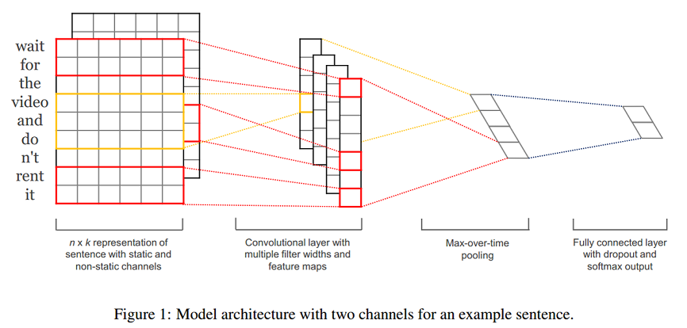
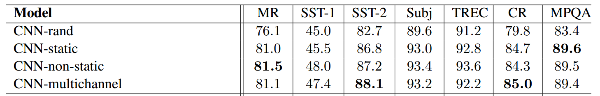

# 论文笔记：Convolutional Neural Networks for Sentence Classification
---------
## 模型推导
- 一个句子是由多个词拼接而成的，如果一个句子有$n$个词，且第i个词表示为$x_i$，词$x_i$通过embedding后表示为k维的向量，即$x_i\in\Re^k$，则一个句子$x_{1:n}$为$n*k$的矩阵，可以形式化如下：
$$X_{1:n}=x_1\oplus x_2\oplus \dots \oplus x_n$$
- 一个包含$h$个的词的词窗口表示为：$$X_{i:i+h-1}\in\Re^{hk}$$
- 一个filter是大小为$h*k$的矩阵，表示为:$$W\in\Re^{hk}$$
- 通过一个filter作用一个词窗口提取可以提取一个特征$c_i$，如下：
$$c_i=f(W \cdot X_{i:i+h-1}+b)$$其中，$b\in\Re$是bias值，$f$为激活函数如Relu等。
- 卷积操作：通过一个filter在整个句子上从句首到句尾扫描一遍，提取每个词窗口的特征，可以得到一个特征图(feature map) $c\in\Re^{n-h+1}$，表示如下(这里默认不对句子进行padding)：
$$c= [c_1, c_2, \dots , c_{n-h+1}]$$
- 池化操作：对一个filter提取到的feature map进行max pooling，得到$\hat{c}\in\Re$即：
$$\hat{c}=max(c)$$
- 若有$m$个filter，则通过一层卷积、一层池化后可以得到一个长度为$m$的向量$z\in\Re^m$:
$$z = [\hat{c}_1, \hat{c}_2, \dots, \hat{c}_m]$$
- 最后，将向量$z$输入到全连接层，得到最终的特征提取向量$y$ (这里的$W$为全连接层的权重，注意与filter进行区分): 
$$y=W \cdot z+b$$
## 优化
### 词向量
- 随机初始化 （CNN-rand）
- 预训练词向量进行初始化，在训练过程中固定 (CNN-static)
- 预训练词向量进行初始化，在训练过程中进行微调 (CNN-non-static)
- 多通道(CNN-multichannel):将固定的预训练词向量和微调的词向量分别当作一个通道(channel)，卷积操作同时在这两个通道上进行，可以类比于图像RGB三通道。

- 上图为模型架构示例，在示例中，句长$n=9$，词向量维度$k=6$，filter有两种窗口大小（或者说kernel size），每种有2个，因此filter总个数$m=4$，其中:
    - 一种的窗口大小$h=2$（红色框），卷积后的向量维度为$n-h+1=7$
    - 另一种窗口大小$h=3$（黄色框），卷积后的向量维度为$n-h+1=6$
### 正则化
- Dropout: 对全连接层的输入$z$向量进行dropout
$$y=W \cdot (z \circ r)+b$$其中$r\in\Re^m$为**masking**向量（每个维度值非0即1，可以通过伯努利分布随机生成），和向量$z$进行元素与元素对应相乘，让$r$向量值为0的位置对应的$z$向量中的元素值失效（梯度无法更新）。
- L2-norms: 对L2正则化项增加限制：当正则项$\lVert W \rVert_2 > s$时, 令$\lVert W \rVert_2 = s$，其中$s$为超参数。
## 实验及讨论
### 实验设置
- Activation function($f$): rectified linear units (ReLu) 
- Filter windows($h$): 3,4,5 with 100 feature maps each 
- Dropout rate($p$): 0.5
- L2 constraint($s$): 3 
- Mini-batch size: 50
- Dev set: randomly select 10% of the train data (for datasets without a standard dev set) 
- Optimizer： stochastic gradient descent(SGD) over shuffled mini-batches with the Adadelta update rule 
- Pre-trained words : word2vec vectors from Google News 
### 实验结果

- SST-1: Paragraph-Vec (Le and Mikolov, 2014), **48.7** 
- Subj : MNB (Wang and Manning, 2012) F-Dropout (Wang and Manning, 2013), **93.6** 
- TREC: SVMS (Silva et al., 2011) **95.6**
### 讨论
- Multichannel vs. Single Channel Models: 虽然作者一开始认为多通道可以预防过拟合，从而应该表现更高，尤其是在小规模数据集上。但事实是，单通道在一些语料上比多通道更好；
- Static vs. Non-static Representations: 在大部分的语料上，CNN-non-static都优于CNN-static，一个解释：预训练词向量可能认为‘good’和‘bad’类似（可能它们有许多类似的上下文），但是对于情感分析任务，good和bad应该要有明显的区分，如果使用CNN-static就无法做调整了；  
- Dropout可以提高2%–4%性能(performance)；
- 对于不在预训练的word2vec中的词，使用均匀分布$U[-a,a]$随机初始化，并且调整$a$使得随机初始化的词向量和预训练的词向量保持相近的方差，可以有微弱提升； 
- 可以尝试其他的词向量预训练语料，如Wikipedia[Collobert et al. (2011)] 
- Adadelta(Zeiler, 2012)和Adagrad(Duchi et al., 2011)可以得到相近的结果，但是所需epoch更少。
## 进一步思考
- 为什么CNN能够用于文本分类（NLP）？
    - [filter相当于N-gram ？](https://www.zhihu.com/question/38544669) 
    - filter只提取局部特征？全局特征怎么办？可以融合吗？
		- [biRNN + CNN = RCNN](https://github.com/llhthinker/NLP-Papers/blob/master/text%20classification/2017-10/Recurrent%20Convolutional%20Neural%20Networks%20for%20Text%20Classification/note.md)
- 超参数怎么调？参见[A Sensitivity Analysis of (and Practitioners' Guide to) Convolutional Neural Networks for Sentence Classification](https://github.com/llhthinker/NLP-Papers/blob/master/text%20classification/2017-10/A%20Sensitivity%20Analysis%20of%20(and%20Practitioners%E2%80%99%20Guide%20to)%20Convolutional/note.md)
    - 用什么样的词向量
    - filter窗口大小、数量
    - 激活函数 (tanh, relu, ...)
    - 池化策略：最大池化就是最好的吗
    - dropout rate
    - 正则化阈值$s$