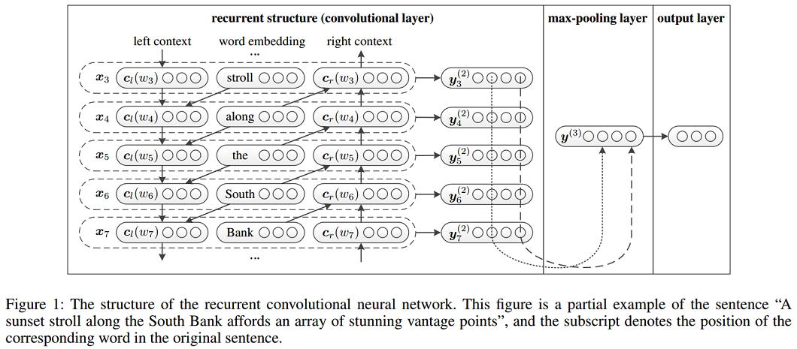
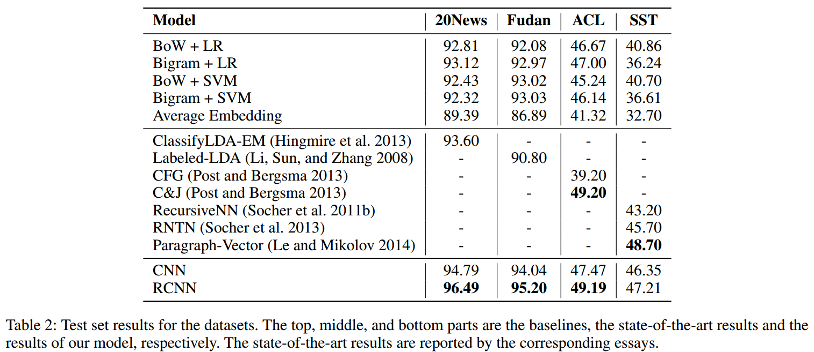
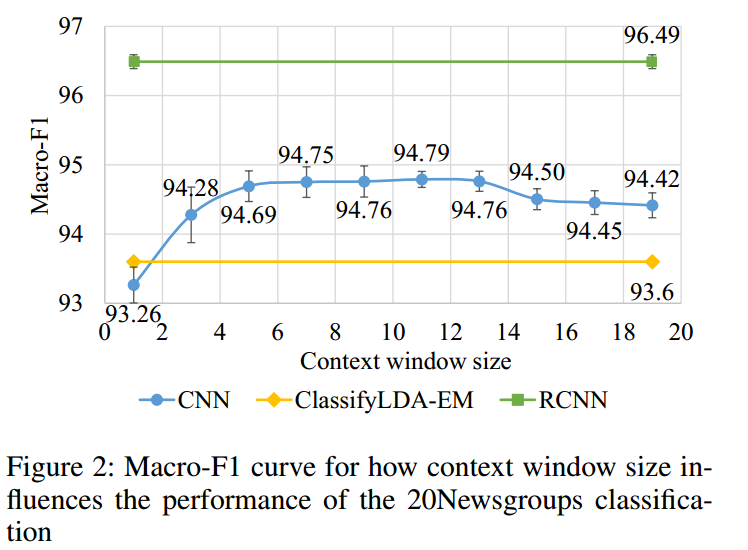
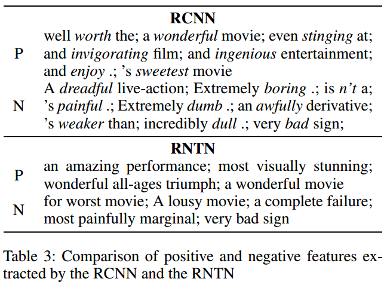

# 论文笔记：Recurrent Convolutional Neural Networks for Text Classification

## RCNN Model

### Word Representation Learning
使用双向RNN分别学习当前词$w_i$的左上下文表示$c_l(w_i)$和右上下文表示$c_r(w_i)$，再与当前词自身的表示$e(w_i)$连接，构成卷积层的输入$x_i$。具体如下:
$$
\begin{align} 
c_l(w_i) = f(W^{(l)}c_l(w_{i-1})+W^{(sl)}e(w_{i-1}))  ; \\
c_r(w_i) = f(W^{(r)}c_r(w_{i-1})+W^{(sr)}e(w_{i-1})) ;  \\
x_i = [c_l(w_i);e(w_i);c_r(w_i)] ; \\
\end{align}
$$
然后将$x_i$作为$w_i$的表示，输入到激活函数为tanh,kernel size为1的卷积层，得到$w_i$的潜在语义向量(latent semantic vector)$y^{(2)}_i$,具体如下：
$$y^{(2)}_i=tanh(W^{(2)}x_i+b^{(2)}) $$
将kernel size设置为1是因为$x_i$中已经包含$w_i$左右上下文的信息，无需再使用窗口大于1的filter进行特征提取。但是需要说明的是，在实践中仍然可以同时使用多种kernel size的filter，如[1, 2, 3]，可能取得更好的效果，一种可能的解释是窗口大于1的filter强化了$w_i$的左右最近的上下文信息。此外，实践中可以使用更复杂的RNN来捕获$w_i$的上下文信息如LSTM和GRU等。

### Text Representation Learning
经过卷积层后，获得了所有词的表示，然后在经过最大池化层和全连接层得到文本的表示，最后通过softmax层进行分类。具体如下： 
(1) Max-pooling layer
$$y^{(3)}=\max \limits_{i=1}^{n} y^{(2)}_i $$
(2) Fully connected layer
​            $$y^{(4)}=W^{(4)}y^{(3)}+b^{(4)}  $$

(3) Softmax layer
$$p_i=\frac{\exp(y^{(4)}_i)}{\sum_{k=1}^n \exp(y^{(4)}_k)} $$
下图为上述过程的一个图解:

## Experiment Settings and Results
### The hyper-parameter settings (may depend on the dataset being used)

- the learning rate of the SGD: 0.01
- the hidden layer size: 100
- the size of the context vector: 50 (left + right = 100)
- the vector size of the word embedding: 50
- Pre-training Word Embedding: 
    - using the default parameter in word2vec with the Skip-gram algorithm. 
    - use Wikipedia dumps in both English and Chinese 

### Results

## Discussion
- **NN vs. traditional methods: 在该论文的所有实验数据集上，神经网络比传统方法的效果都要好** 
    - It proves that neural network based approach can effective compose the semantic representation of texts.
    - Neural networks can capture more contextual information of features compared with traditional methods based on BoW model, and may suffer from the data sparsity problem less. 
- **Convolution-based vs. RecursiveNN: 基于卷积的方法比基于递归神经网络的方法要好** 
    - The convolution-based framework is more suitable for constructing the semantic representation of texts compared with previous neural networks. 
    - The main reason is that CNN can select more discriminative features through the max-pooling layer and capture contextual information through convolutional layer. 
    - By contrast, RecursiveNN can only capture contextual information using semantic composition under the constructed textual tree, which heavily depends on the performance of tree construction. 
    - A lower time complexity [O(n)] than the recursive-based approaches [O(n2)]
- **RCNN vs. CFG and C&J: The RCNN可以捕获更长的模式(patterns)**
    - The RCNN does not require handcrafted feature sets, which means that it might be useful in low-resource languages. 
- **RCNN vs. CNN:  在该论文的所有实验数据集上，RCNN比CNN更好**
    - The reason is the recurrent structure in the RCNN captures contextual information better than window-based structure in CNNs. 

### Discussion：Contextual Information
如何能够更有效捕获上下文信息？通过CNNs与RCNNs对比，如下图，可以知道RCNN更好。

- **CNNs使用固定的词窗口(window of words), 实验结果受窗口大小影响**
    - A small window: a loss of some long-distance patterns, 
    - Large windows: data sparsity, a large number of parameters are more difficult to train
- **RCNNs使用循环结构捕获广泛的上下文信息**
    - The RCNN could capture contextual information with a recurrent structure that does not rely on the window size. 
    - The RCNN outperforms window-based CNNs because the recurrent structure can preserve longer contextual information and introduces less noise. 

### Discussion：Learned Keywords

关键词在文本分类任务中非常重要的决策。因此论文列出了RCNN学习到的一些重要关键词（选择max-pooling层中最频繁被选中的词作为中心的trigram），并与RNTN学习到的关键词作为对比，如Table 3。观察到了如下现象：

- In contrast to the most positive and most negative phrases in RNTN(Socheret al. 2013), RCNN does not rely on a syntactic parser, therefore, the presented n-grams are not typically “phrases”. 
- The results demonstrate that the most important words for positive sentiment are words such as “worth”, “sweetest”, and “wonderful”, and those for negative sentiment are words such as “awfully”, “bad”, and “boring”. 
