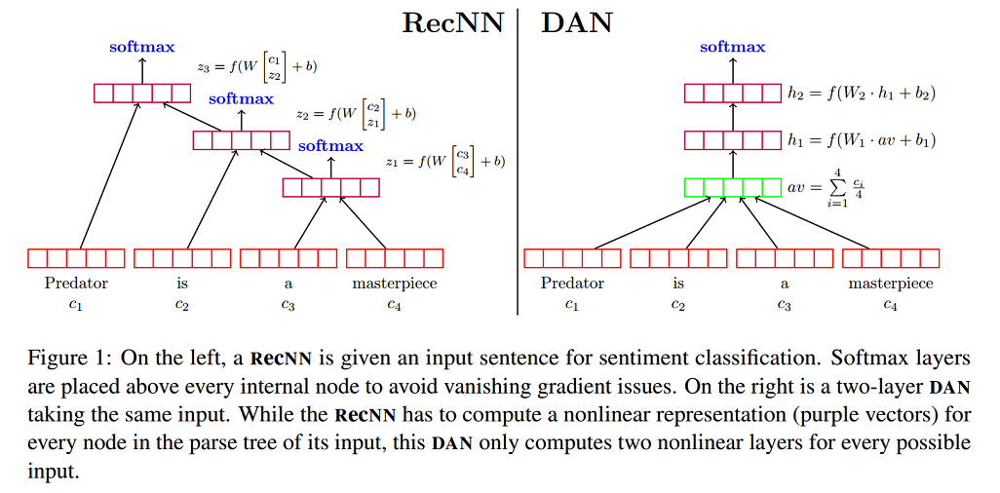

# 论文笔记：Deep Unordered Composition Rivals Syntactic Methods for Text Classification 

本篇论文主要是对比**深层无序组合方法**(Deep Unordered Composition)和**句法方法**(Syntactic Methods)应用在文本分类任务中的优缺点，强调深层无序组合方法的有效性、效率以及灵活性。

## Unordered vs. Syntactic Composition 

### Neural Bag-of-Words Models

论文首先提出了一个最简单的无序模型Neural Bag-of-Words Models (**NBOW** model)。该模型直接将文本中所有词向量的平均值作为文本的表示，然后输入到softmax 层，形式化表示如下：

- Word embedding average :  $z=g(w \in X)=\frac{1}{X} \sum\limits_{w \in X} v_w$
- Softmax Layer:  $\hat{y} = softmax(W_s \cdot z + b)$
- Loss function: cross-entropy error,  $\iota(\hat{y}) =\sum\limits_{p=1}^{k}y_p\log(\hat{y_p}) $

### Considering Syntax for Composition

一些考虑语法的方法：

- Recursive neural networks (**RecNNs**)
  - 可以考虑一些复杂的语言学现象，如否定、转折等 (**优点**)
  - 实现效果依赖输入序列（文本）的句法树（可能不适合长文本和不太规范的文本）
  - 需要更多的训练时间
- Using a convolutional network instead of a RecNN
  - 时间复杂度同样比较大，甚至更大（通过实验结果得出的结论，这取决于filter大小、个数等超参数的设置）

## Deep Averaging Networks 

Deep Averaging Networks (**DAN**)是在**NBOW** model的基础上，通过增加多个隐藏层，增加网络的深度(Deep)。下图为带有两层隐藏层的DAN与RecNN模型的对比。

### Word Dropout Improves Robustness 

- 针对DAN模型，论文提出一种word dropout策略：在求平均词向量前，随机使得文本中的某些单词(token)失效。形式化表示如下：

$$
\begin{align}
r_w \sim Bernoulli(p)  ; \\ 
\hat{X} = \{w|w \in X and r_w  > 0\} ;  \\
z = g(w \in X ) = \frac{\sum_{w \in \hat{X}}v_w}{|\hat{X}|} ; \\
\end{align}
$$

- Word Dropout可能会使得某些非常重要的token失效。然而，使用word dropout往往确实有提升，这可能是因为，一些对标签预测起到关键性作用的word数量往往小于无关紧要的word数量。例如，对于情感分析任务，中立(neutral)的单词往往是最多的。

- Word dropout 同样可以用于其他基于神经网络的方法。

- For RecNNs:

  - 在情感分析任务上，RecNNs使用Word Dropout (将句法树的某些叶子节点置为0向量) 没什么提升

    在问答任务上，RecNNs使用Word Dropout还会使得performance轻微的下降

- Word Dropout或许起到了类似数据增强(Data Augmentation)的作用?

## Experiments

- **Sentiment Analysis**

  - DANs 比其他的词袋模型(bag-of-words models)和许多基于句法的模型都有好，而且使用的训练时间非常少；
  - 尽管DRecNNs模型比DANs复杂，但是两者分类错误的原因却类似；
  - **扰动分析(Perturbation Analysis)**: 随着DAN变得越来越深，消极和积极的句子之间的差别越来越大。这解释了为什么将NBOW模型变深(增加隐藏层)可以提高情感分析任务的实验结果。
  - 处理否定情况和转折情况，仍需要句法信息（如RecNNs）
  - 在大规模语料上进行无监督的预训练，可以捕获一些信息，如情感属性。因此，使用预训练词向量可以提高DAN模型的效果。

- **Factoid Question Answering** 

  - For fair comparison with QANTA, we use a **normalized tanh** activation function at the
    last layer instead of ReLu, and we also change the output layer from a softmax to the [**margin ranking loss**  ]( http://pytorch.org/docs/0.3.0/nn.html#marginrankingloss) used in QANTA.  

  - 只使用问答对的情况下，QANTA (A dependency-tree RecNN called QANTA proposed in [Iyyer et al. (2014a)](https://pdfs.semanticscholar.org/2872/52a5fb2f2a9e311eebf06e5ac49eb52eaadc.pdf) )效果比DAN效果要好; (73.9% ： 71.8%)

  - 使用噪声数据(Wiki)可以有效提高DANs模型的效果; (71.8% -> 77.1% )

  - 虽然噪声数据(Wiki)都会影响DAN和QANTA，但后者可能被问答对和维基百科(Wikipedia)之间的句法差异所阻碍，导致了准确性改进效果非常有限。(73.7% -> 73.9%)

    ​